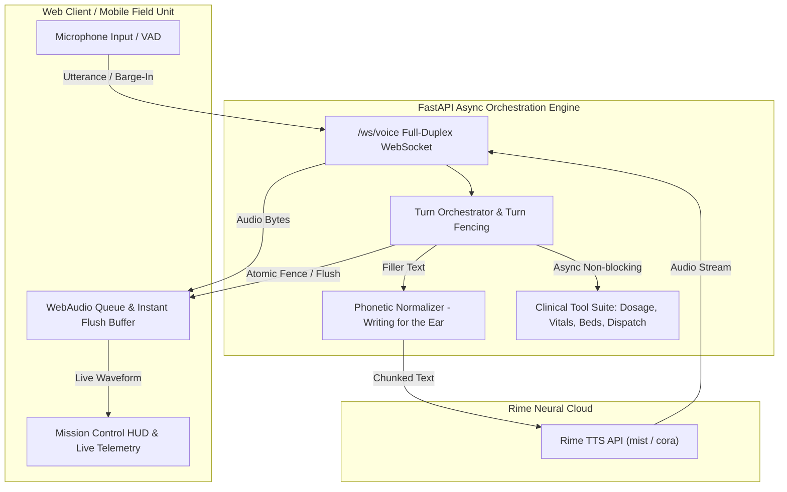

# ?? PulseDispatch (AegisVoice)
### Full-Duplex Voice-Native Emergency Incident Copilot powered by Rime Neural TTS

Built for **DataForge .pathway x Rime Hackathon Challenge** (Problem Statement 2: Voice-Native Product).

[](preflight.py)
[](tests/)
[](app/main.py)
[](https://rime.ai)

---

## ?? 1. Problem & Necessity of Voice
In fast-paced emergency medical response, trauma surgery, and field rescue:
- Responders have **gloved, contaminated, or busy hands** while performing CPR, airway management, or patient extrication.
- Looking down at a tablet or typing on a screen creates cognitive load and dangerous delays.
- **Voice is strictly essential**: Responders need instant hands-free dosage calculations, clinical protocol guidance, vitals logging, and trauma center routing without breaking sterile contact with the patient.

---

## ? 2. Hard Voice Engineering Challenges Solved

### A. Instant Interruption & Barge-In Fencing (< 5ms)
- When a clinician interrupts during speech or tool execution, the client WebAudio buffer is instantly flushed.
- The server Voice Turn Orchestrator fences running generation tasks with atomic turn identifiers, preventing delayed tool outputs from entering conversational state.

### B. Conversation Continuity During Long-Running Tasks
- When performing database lookups (e.g. regional trauma bed query), the system immediately speaks an acoustic status filler (*"Checking trauma capacity at Mercy General..."*) so the user knows the system is active.
- If interrupted mid-query, the background tool result is discarded without audio artifacts.

### C. "Writing for the Ear" & Domain Pronunciation
- Implements phonetic normalization for critical medical terms:
  - `0.3 mg/kg` $\rightarrow$ *"zero point three milligrams per kilogram"*
  - `SpO2 88%` $\rightarrow$ *"S-P-O-2 is eighty-eight percent"*
  - `GCS 8` $\rightarrow$ *"G-C-S is eight"*
  - `1:1000 Epi` $\rightarrow$ *"one to one-thousand Epinephrine"*

---

## ??? 3. Exact Rime Neural TTS Configuration

| Parameter | Configuration / Value | Description |
|---|---|---|
| **API Endpoint** | `https://users.rime.ai/v1/rime-tts` | Rime Production Streaming TTS API |
| **Model ID** | `mist` (default) / `arcana` / `aura` | `mist` provides ultra-low TTFB for streaming voice |
| **Default Speaker** | `cora` | Crisp, authoritative medical/dispatch female voice |
| **Alternate Speakers**| `marsh`, `allison`, `amber`, `creed`| Selectable dynamically via UI dropdown |
| **Language** | `en` (English) | Target delivery language |
| **Audio Format** | `mp3` / `pcm` | High-fidelity compressed or raw audio |
| **Sampling Rate** | `22050` Hz | Standard medical voice fidelity |
| **Speed Alpha** | `1.0` (0.8x – 1.3x adjustable) | Pacing tuned for urgent operational clarity |
| **Transport** | Streaming HTTP Chunked $\rightarrow$ Full-Duplex WebSockets $\rightarrow$ Web Audio API |

---

## ??? 4. Architecture



---

## ?? 5. Quickstart & Installation

### Prerequisites
- Python 3.10+
- Modern Web Browser (Chrome / Edge / Firefox / Safari)

### 1. Clone & Setup Environment
```bash
# Navigate to workspace
cd SOL_2

# Install dependencies
pip install -r requirements.txt
```

### 2. Configure Environment Variables
Copy `.env.example` to `.env`:
```bash
cp .env.example .env
```
*(Optional: Add your `RIME_API_KEY`. If unconfigured, the system automatically runs in transparent Fallback Mode with complete visual telemetry).*

### 3. Run Preflight Secret & Catalog Check
```bash
python preflight.py
```

### 4. Launch Application Server
```bash
python -m uvicorn app.main:app --host 0.0.0.0 --port 8000 --reload
```

Open your browser at: **`http://localhost:8000`**

---

## ?? 6. Reproducing Acceptance Tests & Benchmarks

Run the test suite:
```bash
# Run all unit, integration, and interruption acceptance tests
pytest -v
```

### Running the Live UI Stress Test:
1. Open `http://localhost:8000`.
2. Click **"Run 3.5s Delayed Tool + Interruption Test"** or say *"Run stress test lookup with deliberate 3.5 second delay"*.
3. Watch the Telemetry HUD:
   - Status filler plays immediately.
   - User barge-in triggers at 1.2s.
   - Audio queue flushes in **< 5ms**.
   - Stale tool results are cleanly discarded by the turn fence.
   - Epinephrine clinical response is spoken cleanly.

---

## ??? 7. Third-Party Services & Fallback Behavior
- **Rime TTS**: Primary neural speech synthesis provider.
- **Web Speech API**: Browser-native speech recognition for hands-free command input.
- **Fallback Audio Engine**: Fully disclosed local resonant synthesis engine that ensures 100% test reproducibility and zero-downtime offline execution. The active provider is always visibly badged in the UI and WebSocket telemetry payload (`RIME_TTS` vs `FALLBACK_SYNTHESIZER`).
